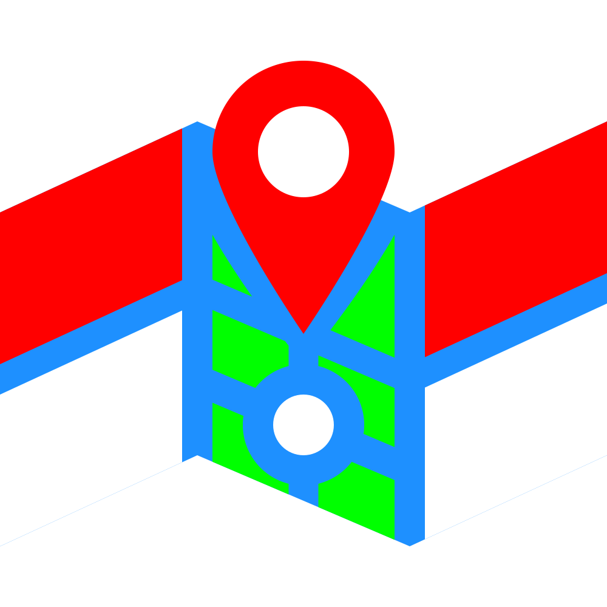

# GeoID :indonesia:
Read Only API for List of Indonesia Geolocation's root and name.

## Structure
More will be added here!

## Reference
- [Region's name & structure](https://kodewilayah.id)
- [Isles name & count](https://id.wikipedia.org/wiki/Daftar_pulau_di_Indonesia_menurut_provinsi?action=raw)
    - [Sumatra](https://id.wikipedia.org/wiki/Daftar_pulau_di_Sumatra?action=raw)
    - [Java](https://id.wikipedia.org/wiki/Daftar_pulau_di_Jawa?action=raw)
    - [Borneo](https://id.wikipedia.org/wiki/Daftar_pulau_di_Kalimantan?action=raw)
    - [Bali Nusa/Small Sunda Islands](https://id.wikipedia.org/wiki/Daftar_pulau_di_Nusa_Tenggara?action=raw)
- [Indonesia Zip Codes](https://kodeposindo.com)

## TO DOs
- [ ] Adding more source data to main JSON. Need Help! :sob:
- [x] Initiating JS development.
    - [x] Migrate to Node.js frameworks.
- [ ] Result test, display, & render.
    - [x] \(Option) If HTML modify not working then we're migrate to node.js libs.
- [ ] Tidy up display style.
- [ ] Publishing API via GitHub Pages.

## License

## :construction: Under Development..
Migrating to Node.js frameworks..
Any contributions are welcome to this repository.